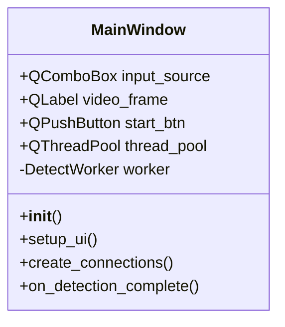
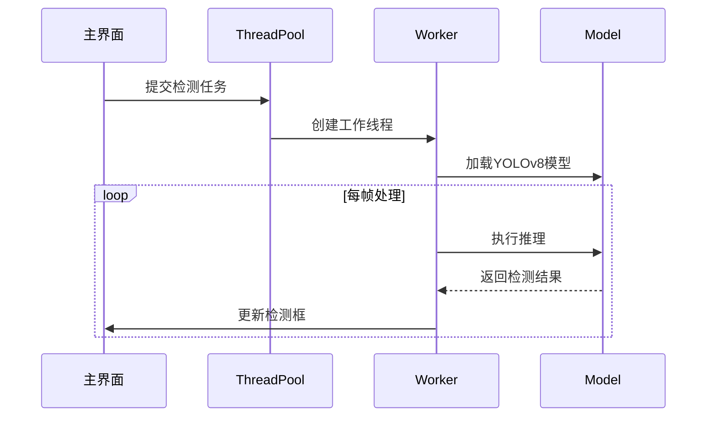
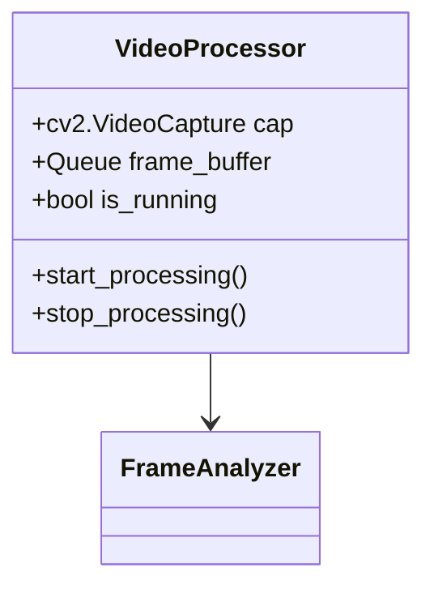

# pt_sysm
pt权重可视化测试系统：方便用于PT权重的检测效果展示（找了很多发现都收费，没钱只好自己开发一款）
## 界面UI展示

### 主页面展示


### 视频模式检测效果展示


### 视频模式


### 图片模式（大量检测并生成label）


### 流媒体


## 界面层架构设计
### MainWindow类结构


## 多线程实现原理
### 检测工作线程
```python
class DetectWorker(QRunnable):
    def __init__(self, model, input_source):
        super().__init__()
        self.model = YOLOv8Model(model_path)
        self.input = VideoStream(input_source)
        
    def run(self):
        while self.input.is_open():
            frame = self.input.read()
            results = self.model.predict(frame)
            self.signals.result_ready.emit(results)
```

## 界面与检测模块交互流程


### 检测模块实现细节
### 图像检测流程
```python
def detect_image(img_path):
    model = YOLO('best.pt')
    results = model(img_path)
    plot_boxes(results, img_path)
    return results
```

### 视频流处理架构


## 关键技术点解析
4. **流媒体处理优化**：
   - 动态调整帧采样率（1~30fps）
   - 基于网络质量的自动分辨率降级
   - RTSP断流重连机制

```python
# 动态帧率调整实现
cap = cv2.VideoCapture(source)
base_fps = 30

while True:
    network_quality = get_network_quality()  # 获取网络质量指标
    
    # 动态调整帧率（1-30fps）
    target_fps = base_fps * network_quality
    cap.set(cv2.CAP_PROP_FPS, max(1, min(target_fps, 30)))
    
    # 分辨率降级（720p->480p）
    if network_quality < 0.5:
        cap.set(cv2.CAP_PROP_FRAME_WIDTH, 640)
        cap.set(cv2.CAP_PROP_FRAME_HEIGHT, 480)
```

5. **结果可视化方案**：
   - 使用OpenCV绘制实时检测框
   - 基于matplotlib生成统计图表
   - 检测结果JSON序列化存储

```python
# OpenCV检测框绘制实现
def draw_boxes(frame, results):
    for box in results:
        x1, y1, x2, y2 = map(int, box.xyxy[0])
        cv2.rectangle(frame, (x1, y1), (x2, y2), (0, 255, 0), 2)
        label = f'{box.cls[0]}: {box.conf[0]:.2f}'
        cv2.putText(frame, label, (x1, y1-10), 
                   cv2.FONT_HERSHEY_SIMPLEX, 0.5, (0,0,255), 1)
    return frame
```
1. **Qt信号槽机制**：
   - 使用PyQt5的Signal/Slot机制实现跨线程通信
   - 自定义QSignals类传递检测结果

```python
# 自定义信号类实现
from PyQt5.QtCore import QObject, pyqtSignal

class QSignals(QObject):
    result_ready = pyqtSignal(object)  # 检测结果信号
    error_occurred = pyqtSignal(str)    # 错误信息信号

    def __init__(self):
        super().__init__()
```

2. **资源管理策略**：
   - 采用上下文管理器自动释放模型资源
   - 使用线程池限制并发检测任务数量

```python
# 模型资源自动释放实现
class YOLOWrapper:
    def __init__(self, model_path):
        self.model = YOLO(model_path)

    def __enter__(self):
        return self.model

    def __exit__(self, exc_type, exc_val, exc_tb):
        self.model.close()
        print('Model resources released!')

# 使用示例
with YOLOWrapper('best.pt') as model:
    results = model.predict(frame)
```

3. **性能优化手段**：
   - 帧缓存队列防止界面卡顿
   - OpenCV DNN模块加速图像预处理
   - 异步日志记录系统
