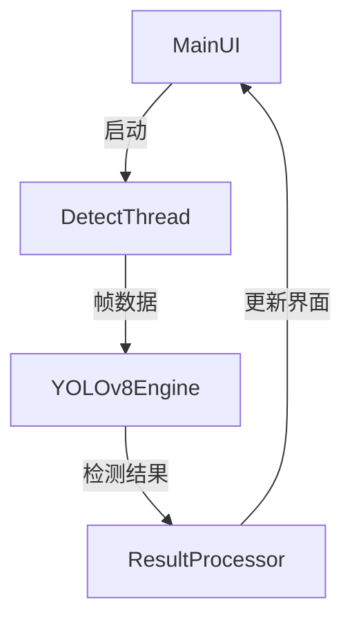

# 权重检测系统使用指南

## 系统架构
### 界面层 (main_window.py)
- PyQt5实现的图形界面
- 视频源选择模块（摄像头/文件/流媒体）
- 实时检测结果显示面板

### 检测核心
- YOLOv8模型推理引擎
- 多线程处理框架
- 图像/视频/流媒体统一处理接口

## YOLOv8集成原理
1. 使用Ultralytics官方Python API加载预训练权重
2. 基于ncnn框架进行模型加速
3. 输入输出张量标准化处理

## 多线程机制


## 权重加载逻辑
1. 自动扫描weights目录下的.pt文件
2. 通过MD5校验确保模型完整性
3. 动态加载模型到显存/内存

## 快速入门
### 环境配置
```bash
pip install -r requirements.txt
```

### 启动系统
```bash
python main_window.py
```

### 执行检测
1. 选择输入源类型
2. 调整置信度阈值 (0.4-0.6推荐)
3. 点击开始检测按钮
